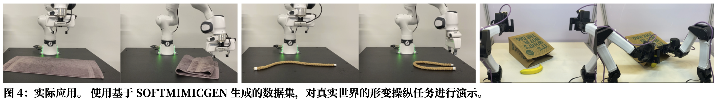
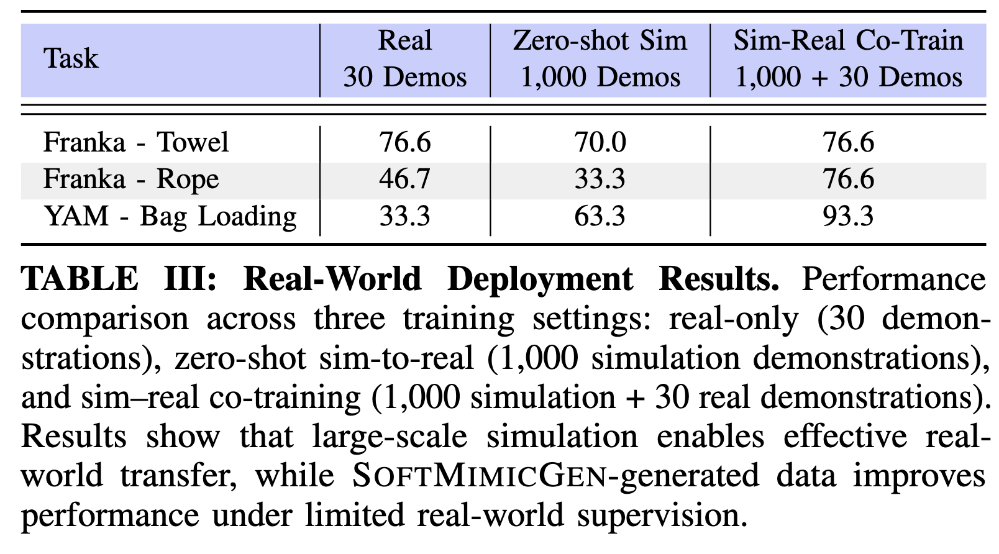

# softmimicgen

## 1. 非刚性配准是如何对齐的

核心思想是：**可变形物体无法用一个刚性坐标系描述**，所以作者放弃了 MimicGen 那种"给物体一个 SE(3) 位姿"的思路，转而用**非刚性配准**建立两个物体状态之间的连续形变场。

**物体表示**（Sec. IV-A）：每个可变形物体用一组 3D 节点位置表示：

$$
O = {n_i}_{i=1}^{N_O}, \quad n_i = (x_i, y_i, z_i) \in \mathbb{R}^3
$$

这些节点来自仿真器的软体求解器（ground-truth nodal information）。这等价于点云表示，刚体也能这样表示——这也是 SoftMimicGen 是 MimicGen 严格泛化的原因。

**配准过程**（Sec. IV-B）：给定两个配置 $O_1 = {a_i}*{i=1}^{N}$ 和 $O_2 = {b_i}*{i=1}^{N}$（比如同一条毛巾两种揉皱方式），非刚性配准求解一个光滑函数

$$
f: \mathbb{R}^3 \to \mathbb{R}^3
$$

通过最小化两项代价：

- 点对点距离：$|f(a_i) - b_i|$
- 正则项：鼓励 $f$ 的平滑性

方法不要求两个配置点数相等，也不需要事先知道点对点对应（引用 Schulman 等 \[19] 和 Chui & Rangarajan 的 TPS-RPM \[47]）。

**如何用于轨迹变换**：拿到形变场 $f$ 后，源轨迹中每个末端位姿 $T_t = (p_t, R_t)$ 按下式变换：

$$
p_t \to f(p_t), \quad R_t \to \text{orth}(J_f(p_t), R_t)
$$

其中 $J_f(p_t)$ 是 $f$ 在 $p_t$ 处的雅可比，$\text{orth}(\cdot)$ 正交化以保证得到合法旋转矩阵。直觉上，雅可比捕获了局部线性形变，所以末端相对可变形物体的局部空间关系在变换后得以保持。

此外，**源 demo 的选择**也用配准代价做——对每个 subtask，把当前场景物体配置和每个源段起始配置各跑一次非刚性配准，选代价最低的那个（类比 MimicGen 的最近邻位姿选择）。

## 2. Sim 和 Real 之间的状态对齐

论文这里做得比较巧妙——**避开了"在真实世界里做非刚性配准"这件事**。关键观察（Sec. V-D）：

> 以往基于 replay 的方法（Schulman 等 \[19,20]）把非刚性配准当作 policy，在真实世界用深度相机点云配准。但点云噪声大，配准精度差，成功率受影响。

SoftMimicGen 的做法是**两阶段解耦**：

**阶段 1（仿真内，数据生成时）**：用仿真器提供的 ground-truth 节点信息做精确配准。这一步只发生在仿真里，不涉及真实传感器噪声，可以生成高成功率的大规模数据集。

**阶段 2（部署时）**：在生成数据上用模仿学习（BC-RNN-GMM 或 Diffusion Policy）训练策略，策略直接从原始图像（仿真评测）或点云（真实部署）输出动作。**推理时不再做任何显式配准**。

**Sim-to-Real 桥梁（Sec. V-E）**：真实部署用了 Point Bridge \[48]——统一的、领域无关的基于点的表示：

- 仿真数据生成时：通过 ground-truth mask 和 depth map 提取可变形物体点云
- 真实部署时：Point Bridge 的 VLM 引导 pipeline 从 RGB-D 观测中提取任务相关物体点
- 策略在**点云观测**上训练和部署，输出动作

换句话说，sim 和 real 的"状态对齐"不是通过几何配准，而是**选择一种 sim 和 real 都能可靠获取的表示（点云）** 来弥合 domain gap。Table III 测了三种配置：real-only（30 条）、zero-shot sim-to-real（1000 条仿真）、sim-real co-training（1000 仿真 + 30 真实），其中 co-training 最好（YAM Bag Loading 从 33.3% 提升到 93.3%）。

## 3. 资产生成与多样性

说实话，**这篇论文在资产生成这块着墨非常少**，算是一个弱点（或者说不是它的重点）。能抽到的信息：

**任务套件规模**（Sec. V-B, Fig. 3）：10 个任务，4 种机器人形态——

- GR1 humanoid：Towel Unfold, Teddy
- Franka：Rope, Jenga, Towel, Rigid Cube
- 手术机器人（dVRK）：Tissue, Threading
- 双臂 YAM：Towel, Bag Loading

涉及的可变形物体：毛绒玩具、绳子、软组织、毛巾；外加刚体 Jenga 块、立方体、香蕉、袋子。

**仿真平台**：Isaac Lab \[10]，用其软体求解器提供节点信息。论文只说"all environments simulate in real-time (or faster)"。

**多样性的实际来源——初始状态分布，而不是资产生成**：论文**没有**自动化生成大量资产（不像 RoboCasa 或 RoboGen 那条线的工作）。每个任务用固定资产，多样性来自**更宽的初始状态分布** $\mathcal{D}'$（Sec. III-B, V-A）：

- 源人类 demo 只覆盖简单变体（1–3 条/任务）
- SoftMimicGen 从更宽的初始分布采样来生成 1000 条 demo/任务
- 例如 Rope 任务：一半绳固定，另一半随机化；Jenga：塔的构型和鞭子的初始状态都随机化

**每个任务生成 1000 条 demo，成功率 70%–100%**。

关于资产"生成"最接近的一句话在 intro 里——提到生成式 AI 工具可以辅助生成场景、资产和任务（引用 RoboGen \[11] 和 RoboCasa \[12]），但这只是大背景铺垫，**SoftMimicGen 自己没做资产生成**——它只做轨迹生成。

所以如果你关心的是"可变形物体资产库的多样性和生成方法"，这篇论文没正面回答；它的贡献集中在**给定少量资产 + 少量 demo，如何扩展出大规模轨迹数据**。资产多样性层面的工作可能得看 RoboCasa、RoboGen。

## 1. 动力学从哪来，有没有做材料多样性

**动力学来源**：Isaac Lab \[10] 的软体求解器。论文原话只说依赖仿真器的 "soft object solver" 提供节点位置（Assumption A0, Sec. III-C）。至于底层是 FEM、PBD、XPBD 还是 MPM 中的哪一种——论文**没说**。Isaac Lab 本身支持多种软体模型，但作者没有公开每个任务用的是哪种求解器、什么参数。

**材料多样性**：**论文里基本没有做，也没讨论**。几点证据：

- 全文没有任何章节讨论材料参数（杨氏模量、泊松比、阻尼、摩擦等）
- 没有 ablation 研究材料变化对策略泛化的影响
- 每个任务的"多样性"描述都只提初始**位置/构型**的随机化，没提材料物性
- 真实部署（Sec. V-E）只用了**一种**真实毛巾、一种真实绳子、一种真实袋子，也没测跨材料迁移

这是一个明显的缺口。相比之下，像 DextrAH、RoboCasa 这类工作至少会做一些物理参数的 domain randomization。SoftMimicGen 的关注点是**轨迹生成机制**，物理参数被当成了固定背景。

你可以合理推测作者对每个物体做了人工调参让它"行为符合预期"（intro 里也承认 "Sourcing and annotating simulation assets for deformable manipulation tasks such that they behave as anticipated is also non-trivial"），但调完就固定了，没做泛化。

## 2. 最后实验只有位置多样性吗？褶皱 / 自折叠软体做了吗

基本上是的，**多样性主要来自初始位置/构型随机化，而不是拓扑或自折叠**。我按任务拆开看：

**Humanoid – Towel Unfold**：毛巾初始是"crumpled"（揉皱）状态，展开铺平。这里**确实涉及褶皱**——但论文没有说明初始褶皱的模式是怎么随机化的、有多少种褶皱构型、是不是每条生成 demo 的初始褶皱都不同。从 Table I 成功率 50.7%（生成数据 + BC-RNN-GMM）来看，这个任务是整个 suite 里较难的，可能确实有一定褶皱多样性，但论文没有量化。

**Franka – Towel / YAM – Towel**：都是**从平整状态折叠**，不是处理已有褶皱。起点是 flat towel。

**Franka – Rope**：一半固定，另一半随机位置，塑形成 U。多样性在**末端位置**，不在绳子的自缠绕/打结拓扑。

**YAM – Bag Loading**：袋子确实是自折叠软体——但任务流程是"右臂先打开袋子，左臂放香蕉进去"。论文没说袋子初始形状是否随机化、有多少种袋子形态。从任务成功率上看（sim 里 BC-RNN-GMM 只有 14.7%，真实 co-train 93.3%），仿真里其实做得并不好——这大概率反映了袋子软体仿真本身的难度，以及多样性覆盖不足。

**衣服**：**完全没做**。没有衬衫、裤子、连衣裙等带自折叠结构的衣物任务。毛巾可以当成简化版的衣物，但衣物的挂袖、领口、纽扣对齐这些 sub-structure 任务论文里一个都没碰。

**打结 / 绳类拓扑任务**：**没做**。Franka-Rope 只做 U 形塑形，没有打结、解结、编织。

所以你的直觉是对的：**褶皱多样性没做系统量化，袋子做了但做得一般，衣服没做**。论文在 Conclusion 里也间接承认了这点——"SoftMimicGen assumes a fixed sequence of object-centric subtasks. Many real-world deformable manipulation tasks are less structured and may require multiple attempts or conditional transitions."（像解结这类任务就需要条件转移和多次尝试，现在的 pipeline 处理不了。）

## 3. 只做了 position generation 吗

这个问的是**生成的维度**。你指的应该是：生成的多样性是不是只在"位置"层面，而不是"状态 / 构型 / 材料 / 物体形状 / 物体种类"？

**答案基本是肯定的，但需要加一点细化**：

**生成了的**：

- **初始位置/姿态**的多样性（通过更宽的初始状态分布 $\mathcal{D}'$ 采样）
- **非刚性形变状态**的多样性——这点比 MimicGen 强，因为非刚性配准能 warp 轨迹去适应**形状不同**的同类物体状态（比如不同揉皱的毛巾），所以不完全是"只有位置"
- Franka–Rope 对比 MimicGen 的实验（50 条里 SoftMimicGen 成功 49，MimicGen 只有 4）正是说明它能处理**构型多样性**，不仅仅是位置平移

**没生成的**：

- **物体实例多样性**：每个任务就一只泰迪熊、一条毛巾、一根绳子——没有多种尺寸/形状/颜色的同类物体
- **材料/物理参数多样性**（见 Q1）
- **物体类别多样性**：不会在同一任务里混不同类别的可变形物体
- **场景/背景多样性**：没看到桌面、光照、干扰物的随机化描述
- **任务结构多样性**：subtask 序列是人工定义且固定的

所以更准确的说法是：**SoftMimicGen 做的是"在固定资产和固定任务结构下，对物体初始构型（包括非刚性形变状态）的多样化轨迹生成"**。"Position generation" 这个描述低估了它对形变状态的处理能力，但"全方位多样化生成"又高估了它——介于两者之间，且明显偏前者。

***

**一句话总结这三个问题**：这篇论文的核心贡献是**把 MimicGen 的轨迹变换机制从 SE(3) 升级到非刚性形变场**，解决了可变形物体上轨迹迁移的问题。但它**没有**在材料物性、物体实例、场景条件、任务结构这些维度做多样性——这些维度的工作被作者留在了未来工作里，或者默认由下游的 sim-real co-training + 真实数据来弥补。

如果你在审这篇论文或者想在这个方向上做后续工作，这三个缺口（材料 randomization、复杂拓扑任务如衣服/打结、资产实例多样性）都是很自然的扩展点。

***

# 延伸

# 论文描述

## 任务

对于可变形物体的类似mimicgen的从少量数据到多条数据的合成

## 问题

对于可变形物体无法姿态估计，使用warp，使用一个warp网络变换轨迹

## 方法

对于姿态估计使用点云配准的方法来进行推理

> 对于sim2real，使用3d表示以及pointbrige（这个不算主要方法）

## 局限

1. 可变形物体不够diversity，缺少at scale的可变形物体资产库的多样化生成方法
   1. 我觉得这里我们需要思考一个问题？what task need deformable diversity？sometime when we are to b，生产标准化的工具比做diversity要简单的多。
2. 任务十分简单，自折叠这些就完全没有考虑。Many real-world deformable manipulation tasks are less structured and may require multiple attempts or conditional transitions."

[GR1-Towel-Dist.mp4](video/GR1-Towel-Dist_mqkOnUCA6P.mp4)

褶皱都没变啊？从视频看，生成的 1000 条 demo 里毛巾的**初始褶皱模式基本是固定的**，变化的主要是毛巾在桌面上的**平移/旋转位置**，而不是褶皱拓扑本身。

1. sim2real的trick
   ### 策略的观测模态——两套不同设置
   #### 仿真评测（Table I, Table II）：RGB 图像
   Sec. V-D 原话：
   > For our simulation results in Tables I and II, these policies learn to manipulate deformable objects directly from raw image input, thereby bypassing explicit registration at inference time.
   > **仿真里策略输入是 raw image**（RGB 图像）。BC-RNN-GMM 和 Diffusion Policy 都是标准的 visuomotor policy 配置，从图像 → 动作。
   #### 真机部署（Table III）：点云
   Sec. V-E 原话：
   > Policies are trained and deployed on these point-based observations and output actions, without using non-rigid registration as an explicit online controller.
   > **真机上策略输入是 Point Bridge 提取的点云**，不是 RGB 图像。
   ### 为什么真机换成点云（不用图像）
   这是 Sec. V-E 的核心设计。用 Point Bridge \[48] 的原因是**弥合 sim-to-real gap**：

   **用图像的问题**：仿真里的毛巾/绳子/袋子的视觉外观（纹理、光照、颜色、渲染质量）和真实物体差距很大。如果策略在 sim 的 RGB 图像上训练，真机 RGB 输入进去就是严重 OOD——视觉 domain gap 会让策略直接失效。这是 sim-to-real 的经典难题。

差异 3：显式的结构先验降低了学习负担
点云 policy（PointNet 架构）强制输入是 {(x1,y1,z1),(x2,y2,z2),...}\\{(x\_1, y\_1, z\_1), (x\_2, y\_2, z\_2), ...\\}
{(x1,y1,z1),(x2,y2,z2),...} 的结构。这个结构里几何关系是直接可见的——policy 不需要学"这个像素到相机的距离大约是多少"，直接就有 (x, y, z)。
对于小数据量下的模仿学习（1000 条 demo），这种显式先验很有价值。图像 policy 要学到同样能力需要更多数据。
但注意——在大数据量下（比如 VLA 训练的百万条），这个优势就会消失。RT-2、OpenVLA、π₀ 都是图像输入，它们能 work 说明只要数据够多，图像 policy 可以学到一切。

***

**1. 它解决的是“deformable 数据生成”，不是“at-scale deformable asset generation”。**
SOFTMIMICGEN 的核心贡献是：给定少量人类示教，利用**non-rigid registration**去 warp source trajectory，从而在**已有仿真任务和已有资产**上生成更多轨迹数据；它并没有提出一套大规模、多样化 deformable 资产的自动生成方法。论文里的对象类别其实还是比较有限，主要是**stuffed animal, rope, tissue, towel**，任务也是作者手工构建的一组 simulation environments，而不是一个可扩展的 deformable asset factory。

所以你这点更准确可以写成：

**SOFTMIMICGEN improves trajectory-level data scalability for deformable manipulation, but not asset-level scalability: it lacks a method for automatically generating large-scale, diverse deformable object assets, materials, and task contexts.**

***

**Many real-world deformable manipulation tasks are less structured and may require multiple attempts or conditional transitions.**

***

SOFTMIMICGEN 将可扩展数据生成从刚体拓展到了可变形物体操作，但其多样性主要体现在轨迹与初始状态分布，而非大规模可变形资产库的自动生成；同时，其方法依赖固定的 object-centric subtask 序列，因而仍难以处理衣物折叠、复杂装袋等低结构、长时程、需多次尝试与条件跳转的真实可变形操作任务。
