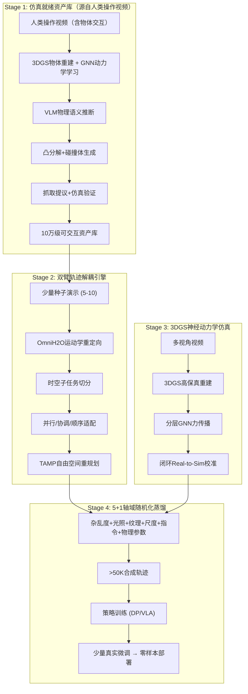

# 研究提案：DualDeform-Gen — 面向机器人模仿学习物体泛化的低成本可扩展数据合成框架

**聚焦灵巧双臂与可变形物体 | Real-to-Sim-to-Real 闭环**

---

## 1. 任务定义 (Task)

### 1.1 背景与动机

机器人模仿学习的性能严重依赖于大规模高质量演示数据。Data Scaling Laws [Hu et al., 2024] 证实，策略泛化性能与训练环境和物体的多样性呈近似**幂律关系**（power-law）——物体多样性远比演示数量更重要。这一结论被 RT-1 [Brohan et al., 2023]（移除25%任务多样性=移除49%数据量的同等性能损失）和 DROID [Khazatsky et al., 2024]（跨多样场景的7.3K轨迹 ≫ 限于20场景的相同数量轨迹）独立验证。每个（环境,物体）对的演示一旦达到阈值（~50个），额外数据收益递减——该阈值经充分验证：研究者实际收集了最高**120个演示/对**，通过变换训练集规模确认50个后性能严格饱和 [Hu et al., 2024]。但作者也明确指出该阈值"specific to tasks of similar difficulty to ours"，**更困难的灵巧操作任务可能需要更多演示** [Hu et al., 2024]。**值得注意的是，该 Scaling Law 迄今仅在单臂任务上验证——尚无工作在双臂协调任务上研究数据缩放规律**，本工作将首次在双臂场景中系统验证该规律（见实验4.3）。MimicGen [Mandlekar et al., 2023] 进一步证明仅10条人类演示生成的合成数据可匹敌200条人类演示，但从1000增至5000时收益显著递减。值得注意的是，对于长horizon复杂任务（如多步装配、穿线），数据量的作用仍不可忽视 [Mandlekar et al., 2021; SkillGen, 2024]。

当前最大的人类遥操作数据集（DROID、Open X-Embodiment、AgiBot World）与训练前沿 LLM/VLM 所需的语料库相比仍小 **100,000倍以上** [R2R2R, Yu et al. 2025]。Data Scaling Laws [Hu et al., 2024] 自身的验证实验表明：4名采集员工作一个下午，即可为两个任务收集足够数据达到约90%零样本成功率——但这仍需跨32个环境-物体对收集数据，总量超4万条演示，凸显了多样性采集的高成本。

> [!IMPORTANT]
> **核心设计原则（来自 Data Scaling Laws）**：优先扩大多样性覆盖（更多物体实例×更多环境×更多组合），再考虑每一组合内的示范密度。

### 1.2 研究任务

构建一个 **Real-to-Sim-to-Real** 闭环数据合成框架，从少量人类演示（5-10条）出发，自动合成大规模（>50K轨迹）多样化操作演示，实现策略在**未见物体**、**未见场景**下的零样本部署。

**形式化定义**：给定机器人本体（双臂/灵巧手）和任务族，目标是合成多模态训练集 D = {(o_t, a_t, s_t, ℓ_t)}，其中 o_t 为观测（RGB/深度/触觉），a_t 为双臂控制量，ℓ_t 为语言指令。该数据集需支持在未见物体实例、未见姿态/尺度、未见场景下的成功率提升。

| 泛化维度 | 描述 | 难度 |
|:---|:---|:---|
| 物体种类 | 未见过的物体实例/类别 | ⭐⭐⭐ |
| 物体姿态 | 不同放置位置和朝向 | ⭐⭐ |
| 物体外观 | 颜色、纹理、材质变化 | ⭐⭐ |
| 物体物理属性 | 刚度、摩擦、弹性系数（可变形物体） | ⭐⭐⭐ |
| 场景背景 | 不同桌面、光照、杂物干扰 | ⭐ |
| 语言指令 | 不同表述方式的等价任务命令 | ⭐⭐ |

---

## 2. 问题分析 (Problem)

### 2.1 三大技术瓶颈

#### 瓶颈一：可迁移数据有限 / 资产成本高昂

| 方法类别 | 代表工作 | 局限性 |
|:---|:---|:---|
| **Sim-based 轨迹合成** | MimicGen, SkillMimicGen | 严格依赖 on-robot rollout（真机时间与人工采集相当），且零样本 sim-to-real 迁移极差（MimicGen 仅5%，SkillGen 35%）[原论文实验数据] |
| **点云轨迹增强** | DemoGen | 仅空间泛化（同物体不同位姿），不支持物体实例级替换；可变形仅有限支持 |
| **2D 图像增强** | GenAug, ROSIE, RoViAug | 缺乏3D空间一致性 |
| **Real-to-Sim 重建** | Re3Sim, RoboGSim, AOMGen | 每场景需重建（本方法亦有此限制）；AOMGen 仅限铰接体 |
| **3DGS 直接编辑** | RoboSplat | 仅单臂+刚体 |
| **渲染管线** | R2R2R | 每物体需手机扫描 |
| **LLM 驱动** | GenSim2, RoboTwin 2.0 | 依赖已有3D资产库提供初始几何，但该库可通过 Objaverse 等开源项目补充 |
| **自主探索** | Tether [ICLR 2026] | 10条演示自主生成1085轨迹/26h [Liang et al., 2026]，但仅限简单pick-and-place级任务，无法扩展到可变形物体或精细力控 |
| **资产库** | ManiTwin-100K | 仅刚体抓取；缺交互语义 |

> **资产瓶颈的本质**：多数开源3D模型库（ShapeNet, Objaverse）仅含几何网格，缺少质量/摩擦/碰撞体积/抓取点等物理交互语义，不是"仿真就绪"（simulation-ready）的。
>
> **MimicGen 的双重瓶颈**：(1) **Sim-to-real gap**——MimicGen 零样本 sim-to-real 仅 **5%** 成功率（原论文 Table 3 real-world experiments），SkillGen 通过技能分解提升至 **35%**（原论文 Table 2 sim-to-real transfer results）——纯仿真数据训练的策略部署效果极差；(2) **真机 rollout 成本**——虽然 MimicGen 种子成本极低（10条仅需4分钟 [SkillGen, 2024]），但生成的轨迹需在真机上 on-robot rollout 验证，**真机执行时间与人工采集相当**（每条轨迹需机器人实际执行，包含重置和失败重试），无法通过GPU并行加速。

#### 瓶颈二：双臂灵巧协同的运动学复杂性

双臂操作不是两个单臂的简单叠加 [RDT-1B, Liu et al., 2024]。双臂动作空间翻倍导致高度**多模态动作分布**，与基础模型的数据需求产生根本冲突 [RDT-1B, 2024]。BiGym [Chernyadev et al., 2024] 指出双臂+移动引入的任务空间高复杂度使得学习算法难以泛化。DexMimicGen [Jiang et al., 2024] 正式定义了双臂操作的三类时空依赖子任务分类：
- **并行子任务**：左右手独立目标，需异步执行策略，各自维护独立动作队列 [DexMimicGen, 2024]
- **协调子任务**：双手共持物体（如合作放置盖子），需同步策略确保末端执行器相对位姿一致 [DexMimicGen, 2024]
- **顺序子任务**：因果依赖（如先倒球再移碗），前置状态完成后才激活后续动作 [DexMimicGen, 2024]

UMI [Chi et al., 2024] 在双臂衣物折叠实验中发现，即使一只手臂比另一只快或慢一点点，任务即会失败——这要求极高的时间协调精度。ACT [Zhao et al., 2023] 指出双臂精细操作常在机器人奇点附近进行，传统逆运动学频繁失效。

#### 瓶颈三：可变形物体的双重鸿沟

| 鸿沟类型 | 描述 |
|:---|:---|
| **动力学鸿沟** | 预设物理参数（杨氏模量、泊松比）极难现实辨识，仿真形变与现实大相径庭 [SoMA, 2025; PhysTwin, 2025] |
| **视觉鸿沟** | 软体受压/折叠时产生高频几何细节（褶皱、自阴影），传统网格渲染无法逼真再现 |

SoMA [2025] 实验发现，基于学习的神经动力学模型在严重遮挡、无纹理物体或超出训练分布的复杂接触模式下性能显著退化，且当前仅在4类物体上验证规模化。更关键的是，SoMA 的**物体级泛化能力有限**——它需要针对每个特定目标物体进行初始3DGS重建（条件化于 $G_0$），且**必须使用包含动作条件的交互视频**来训练动力学：SoMA 需要已知关节状态的机器人操作视频 [SoMA, 2025]，PhysTwin 可使用人手操作视频（通过 Grounded-SAM2 分割手部+CoTracker3 追踪运动 [PhysTwin, 2025]），但两者都不能从纯静态观察中学习——**必须有外力驱动物体产生形变的交互过程**。PhysTwin [2025] 指出仅基于单一交互类型的参数优化限制了模型的鲁棒性，需扩展至多种动作模态。

此外，**可变形物体的 3DGS 渲染本身仍存在重大挑战**：(1) 机器人末端执行器和物体自接触导致的部分可观测性使得纯图像损失引入虚假梯度 [SoMA, 2025]；(2) 单个高斯点的微小预测误差在长时间序列中快速累积，导致几何结构坍塌 [SoMA, 2025]；(3) 标准动态3DGS仅拟合视觉外观而缺乏物理约束，暴露于新动作时无法预测未来状态 [PhysTwin, 2025]。

传统方案中，MPM（MLS-MPM）擅长大变形和断裂仿真 [CulinaryCut, 2025]，PBD 适合高效稳定的布料仿真 [GarmentLab, 2024]，FEM 适合精确弹性力学 [GarmentLab, 2024]，但三者均需预设物理参数。

### 2.2 综述确认的领域空白

**综述一：《Robotic Manipulation via Imitation Learning: Taxonomy...》**（Li et al., arXiv:2508.17449, 2025）

Section VII-B 列出5大 open challenges，其中明确指出：
- *"Dual-arm collaborative manipulation and high-degree-of-freedom manipulation are still in their early stages"*
- *"Current methods remain heavily reliant on expert data...restricts the scalability"*

**综述二：《Interactive IL for Dexterous Manipulation》**（Frontiers, arXiv:2506.00098, 2025）

- *"IIL for dexterous manipulation is an emerging field...notable gap in concrete studies"*
- 训练数据需求随动作空间维度指数增长

**综合确认的核心 gap：无方法同时低成本解决双臂 + 可变形 + 大规模物体泛化数据合成。**

### 2.3 现有方法能力矩阵

| 方法 | 单臂 | 双臂 | 刚体 | 可变形 | 物体泛化 | Sim2Real | 数据范式 |
|:---|:---:|:---:|:---:|:---:|:---:|:---:|:---:|
| MimicGen / SkillMimicGen | ✅ | ❌ | ✅ | ❌ | 空间 | 5%/35% | On-robot rollout |
| DexMimicGen | ✅ | ✅ | ✅ | ❌ | 空间 | 有限 | 轨迹变换 |
| DemoGen | ✅ | ✅ | ✅ | ✅* | 空间 | 未报告 | 点云增强 |
| RoboSplat | ✅ | ❌ | ✅ | ❌ | 6类 | ✅ | 3DGS编辑 |
| AOMGen (CVPR'26) | ✅ | ❌ | ✅ | ❌ | 铰接体 | ✅ | 单扫描+物理引擎 |
| R2R2R | ✅ | ❌ | ✅ | ❌ | 种类+姿态 | ✅ | 渲染管线 |
| Tether [ICLR'26] | ✅ | ❌ | ✅ | ❌ | 语义 | ✅ | 自主探索 |
| FoldNet | ✅ | ✅ | ❌ | ✅* | 衣物 | 有限 | 仿真 |
| RoboTwin 2.0 | ❌ | ✅ | ✅ | ❌ | 有限 | 有限 | LLM+仿真 |
| **Ours** | **✅** | **✅** | **✅** | **✅** | **全面** | **目标>60%** | **真实演示→3DGS合成** |

> **与 AOMGen 的核心区分**：AOMGen 通过刚体物理引擎处理铰接体，是该子领域 SOTA。本工作在其无法触及的两个维度（可变形软体的 GNN 力传播 + 双臂力耦合解耦）上提供不可替代贡献。在铰接体任务上，AOMGen 是主要 baseline。

---

## 3. 方法设计: DualDeform-Gen

### 3.1 四阶段架构



### 3.2 Stage 1: 人类操作视频驱动的仿真就绪资产流水线

**核心理念**：不从静态图像/3D模型出发，而是**从人类操作物体的视频中同时提取几何资产和物理动力学**。PhysTwin [2025] 已证明可从稀疏 RGB-D 人手交互视频中同时重建物体外观和学习弹簧-质点动力学模型，SoMA [2025] 亦验证了人手数据对 GNN 动力学的泛化支持。这一设计选择有两个关键优势：(a) 人类操作视频远比机器人操作视频丰富且获取成本低；(b) 交互过程本身提供了学习动力学所必需的力-形变对应关系。

1. **人类操作视频采集与物体重建**：多视角 RGB-D 摄像头录制人类与物体交互的短视频（1-10秒推/拉/捏/折），使用 Grounded-SAM2 分割人手、CoTracker3 追踪手部运动作为控制信号 [PhysTwin, 2025]。同步从首帧重建 3DGS 几何表示
2. **GNN 动力学联合学习**：利用人手交互视频中的力-形变响应，训练 GNN 弹簧-质点/层级高斯动力学模型。**跨多物体联合训练可提升 GNN 泛化性** [SoMA, 2025 ablation: joint training improves generalization despite slight resimulation accuracy drop]，而非为每个物体独立训练
3. **VLM物理语义推断**：调用视觉-语言模型识别材质（金属/木材/布料），自动分配密度、质量、质心；生成紧密OBB和凸分解碰撞体。VLM 推断本质为"AI近似" [Scalable Real2Sim, Pfaff et al., 2025]，但 SIMPLER [Li et al., 2024] 发现 ±15% 物理参数偏差对策略评估影响有限
4. **语言与功能标注**：VLM自动生成多维度描述（类别/颜色/形状/用途），识别功能交互点（把手/盖子），附加操作语义标签
5. **仿真验证抓取生成**：预训练抓取网络采样数百候选位姿，后台物理仿真受力测试，保留10-50个稳定6-DoF抓取点

| 维度 | 传统数据集 (ShapeNet/Objaverse) | 本框架 (ManiTwin范式) |
|:---|:---|:---|
| 物理属性 | 缺失 | VLM推断的精确参数 |
| 碰撞体积 | 粗糙包围盒 | 精细凸分解 |
| 抓取点 | 缺失 | 10-50个仿真验证位姿 |
| 可变形支持 | ❌ | Physics-Augmented GS |

### 3.3 Stage 2: 时空重绑定双臂解耦引擎

基于 DexMimicGen 的洞察，结合 TAMP 算法：

1. **运动学重定向**：通过 OmniH2O 系统解算人手骨骼点相对手掌根的空间向量，平滑映射至高自由度灵巧手，克服关节奇点
2. **时空子任务切分**：分析双臂动态距离和施力反馈，自动识别并行/协调/顺序子任务
3. **分类适配**：
   - 并行段：左右手基于各自目标物体坐标系独立 SE(3) 变换
   - 协调段：构建虚拟锚点，双手作为刚体组合整体重映射
   - 顺序段：强制因果状态检查，前置状态达成后才激活后续映射
4. **TAMP自由空间重规划**：防碰撞路径规划 + MLLM任务代码辅助验证

### 3.4 Stage 3: 3DGS-GNN神经动力学软体仿真

抛弃传统有限元网格，采用 SoMA [2025] / PhysTwin [2025] 架构，核心创新在于将 3DGS 渲染与 GNN 物理动力学深度耦合。

**为什么选择 GNN 而非 Diffusion / Transformer？** 三种架构各有优劣：

| 架构 | 推理延迟 | 参数规模 | 物理约束 | 适用场景 |
|:---|:---|:---|:---|:---|
| **GNN** | ~8ms | ~1M | 显式局部力传播+动量守恒正则 | 实时交互仿真 |
| **Transformer** (POINTWORLD) | ~120ms | 可达1B | 隐式长程注意力 | 大规模世界建模 |
| **Diffusion** | **数秒** | ~100M+ | 无显式物理约束 | 视频/图像生成 |

- **GNN** 因其**关系归纳偏置**自然适合建模局部粒子间物理交互 [PhysTwin, 2025]，且推理延迟极低（~8ms），支持实时候选轨迹评估
- **Transformer** (POINTWORLD [2025]) 可扩展至 **1B参数**（GNN 的957×），展现 log-linear 增益，但推理延迟（~120ms）更高，且不直接编码力学约束
- **Diffusion** 模型在像素空间世界模型和动作策略上表现优异（如 Diffusion Policy [Chi, 2023]），但 POINTWORLD [2025] 明确指出 diffusion 目标函数需要 **"seconds-long inference"**，对实时3D粒子追踪/轨迹评估完全不可行——**无法在0.1秒内评估多条候选轨迹**。此外，diffusion 模型学习的是分布而非确定性动力学映射，难以施加能量守恒等硬物理约束

本方案暂选 GNN 以确保物理一致性和实时性，但保留向 Transformer 骨干升级的接口。Stage 1 已从人类操作视频中联合训练 GNN 动力学（见 3.2），此处 Stage 3 聚焦于**机器人动作条件下的精细校准**：

相比传统方案（MPM 适合大变形和断裂 [CulinaryCut, 2025]，PBD 适合布料 [GarmentLab, 2024]，FEM 适合弹性体 [GarmentLab, 2024]），GNN 力传播方案通过数据驱动学习绕过了参数标定问题：

1. **3DGS高保真体积重建**：多视角RGB摄像头录制短视频→数百万高斯椭球体 G_i = (μ_i, Σ_i, α_i, SH_i)，实时渲染逼真褶皱和阴影

2. **GNN消息传递力传播**：相邻高斯点按欧氏距离连接成图 G=(V,E)，通过可学习边函数驱动力传播。核心动力学方程：

```
f_i = Σ_{j∈N(i)} φ_edge(x_i - x_j, v_i - v_j; θ_elastic) + f_ext,i(a_robot)
x_i(t+Δt) = x_i(t) + v_i·Δt + (f_i / m_i)·Δt²/2
v_i(t+Δt) = v_i(t) + (f_i / m_i)·Δt
```

其中 φ_edge 是由多层 MLP 参数化的边函数。弹性参数采用**分解设计** θ_elastic = θ_material ⊕ θ_geometry：
- **θ_material**：材质固有弹性（棉/丝/皮革），跨同材质实例共享
- **θ_geometry**：几何依赖弹性（厚度/层数/缝线），从 3DGS 几何自动推断

f_ext,i 为机器人末端执行器施加的外力。自碰撞通过 octree 空间索引检测（O(N log N)，10-50K 高斯点在 A100 上 30+ FPS）。

3. **闭环Real-to-Sim校准（100-500帧）**：GNN训练分两阶段：(a) 在合成FEM数据上预训练通用弹性传播先验，(b) 用真实视频通过可微渲染损失 L_render + 几何损失 L_geo 微调 θ_elastic。每个新**材质类别**需 5-10 min 校准。

4. **双臂力耦合传播（Showcase: Bimanual Cloth Shaking）**：当双手同时操作同一可变形物体（如双手抓住衣服两端抖开），左右手的力通过 GNN 图路径传导到同一软体上，实现双臂力耦合的真实仿真。这是 **AOMGen、DexMimicGen 和 Bimanual Deformable Bag** (arXiv 2024, 使用稀疏 PoI 表示) **都无法处理的新场景**。

> 该方案同时消除**动力学鸿沟**（GNN自适应学习物理参数，无需手动标定杨氏模量）和**视觉鸿沟**（3DGS照片级渲染）。

#### GNN 实现细节

| 参数 | 值 | 说明 |
|:---|:---|:---|
| φ_edge MLP | [128, 64, 32] + ReLU | 边函数网络架构 |
| \|N(i)\| 平均邻居数 | 12 | 3σ 欧氏距离阈值 |
| 高斯点数 | 10K-50K | 视物体复杂度而定 |
| Octree 重建频率 | 每 5 步 | 自碰撞检测用 |
| 端到端延迟 | GNN 8ms + 3DGS 18ms + Octree 6ms | @20K点 A100 |
| 端到端帧率 | **~22 FPS @ 20K 高斯点** | Offline 数据生成足够 |
| FEM 预训练材质 | 8种 (棉/丝/皮/橡胶/海绵/涡论/编织/塞化硬泵泡沫) | 覆盖主流可变形材质 |

### 3.5 Stage 4: 5+1轴域随机化策略蒸馏

在 RoboTwin 2.0 [Chen et al., 2025] 已验证高效的5轴结构化随机化（杂乱度/光照/纹理/尺度/指令，报告228%零样本相对增益）基础上，针对可变形物体操作增加第6轴——物理参数随机化。OpenAI Solving Rubik's Cube [2020] 证明自动域随机化（ADR）远优于手动调参，且多样性（而非对抗性）最有利于迁移。SIMPLER [Li et al., 2024] 发现相机位姿和桌面纹理的影响远大于光照和干扰物。RoboTransfer [2025] 指出标准颜色随机化不足以建模局部化结构变化，需针对物体和背景分别增强：

| 轴 | 随机化内容 | 目的 |
|:---|:---|:---|
| 杂乱度 | 物理防碰撞随机干扰物放置 | 抗背景干扰 |
| 光照 | 色温2700K-6500K + 光强0.5-2.0× | 抗光照变化 |
| 纹理 | 生成式AI程序化合成桌面/墙壁纹理 | 抗背景过拟合 |
| 尺度 | 桌面高度 + 物体几何尺寸微扰 | 平移不变性 |
| 指令 | LLM改写数十种语义等价句法 | 语言泛化 |
| **物理参数** | **刚度/摩擦/弹性系数变化** | **可变形物体鲁棒** |
| **物体实例** | **VLM驱动的仿真就绪资产替换** | **物体级泛化** |

### 3.6 技术亮点对比

| 特性 | DemoGen | RoboSplat | AOMGen | DexMimicGen | RoboTwin 2.0 | **Ours** |
|:---|:---:|:---:|:---:|:---:|:---:|:---:|
| 视觉保真度 | 点云(低) | 3DGS(高) | 3DGS(高) | 仿真(中) | 仿真(中) | **3DGS+GNN(高)** |
| 物体替换 | ❌ | ✅(需资产) | ✅(需扫描) | ❌ | ✅(需资产) | **✅(VLM自动)** |
| 双臂+灵巧手 | ✅ | ❌ | ❌ | ✅ | ✅ | **✅** |
| 可变形物体 | ✅(有限) | ❌ | ❌ | ❌ | ❌ | **✅** |
| 软体物理仿真 | ❌ | ❌ | ❌ | ❌ | ❌ | **GNN力传播** |
| 资产获取成本 | 低 | 高 | 高 | N/A | 中 | **低(VLM)** |
| 域随机化 | ❌ | 部分 | 部分 | ❌ | 5轴 | **5+1轴** |

---

## 4. 实验设计 (Experiments)

### 4.1 平台

| 平台 | 机器人 | 任务类型 |
|:---|:---|:---|
| 仿真 | MetaWorld (Yu et al., 2021) 单臂 | 刚体抓取放置基准 |
| 仿真 | 双臂仿真环境 (RoboTwin/自建) | 双臂协调 |
| 仿真 | Isaac Gym + 3DGS-GNN | 软体交互 |
| 真实 | Franka Panda (单臂) | 单臂刚体/可变形验证 |
| 真实 | 方舟无限双臂 | 双臂协调验证 |
| 真实 | 大族双臂 | 双臂协调验证（跨平台泛化） |

### 4.2 20级核心任务矩阵

#### 刚体+铰接体 (4 tasks)
| 任务 | 描述 | 指标 | Benchmark 来源 |
|:---|:---|:---|:---|
| Pick-and-Place | 未见物体抓取放置 | 成功率 | MetaWorld / 标准 |
| Object Sorting | 按类别分类未见物体 | 准确率 | MetaWorld |
| Articulated Opening | 打开未见铰接物体（门/抽屉） | 成功率 | AOMGen |
| Tool Use | 使用未见工具执行任务 | 成功率 | 标准 |

#### 可变形物体 (7 tasks，含外卖袋系列)
| 任务 | 描述 | 指标 | Benchmark 来源 |
|:---|:---|:---|:---|
| Cloth Fold | 折叠未见衣物（T恤/裤子） | IoU + 成功率 | **GarmentLab fold** |
| Cloth Unfold | 展开堆叠衣物 | 覆盖面积 | **GarmentLab unfold** |
| Cloth Hang | 将衣物挂到衣架上 | 成功率 | **GarmentLab hang** |
| Rope Routing | 绳索路由到目标形状 | 形状误差 | 自定义 |
| Soft Body Packing | 毛绒玩具装入容器 | 成功率 | PokeFlex 对齐 |
| **Delivery Bag Opening** | **双手打开未见外卖袋** | **成功率 + 开口面积** | **美团横向（自定义）** |
| **Delivery Bag Packing** | **将物品装入已打开外卖袋** | **成功率 + 物品稳定性** | **美团横向（自定义）** |

#### 双臂协调 (5 tasks)
| 任务 | 描述 | 指标 | Benchmark 来源 |
|:---|:---|:---|:---|
| Bimanual Handover | 双臂接力传递物体 | 成功率 | RoboTwin |
| Collaborative Lift | 双臂协作搬运重物 | 成功率 | RoboTwin |
| **Bimanual Cloth Shaking** | **双手抓衣服两端抖开** | **IoU + 力一致性** | **本工作独特** |
| Assembly | 双臂配合精细组装 | 完成度 | BiGym |
| **Bimanual Delivery Bag Shake** | **双手抓外卖袋两端抖开** | **开口面积 + 力一致性** | **美团横向（自定义）** |

#### 单臂+双臂 交叉验证 (5 tasks)
| 任务 | 描述 | 目的 |
|:---|:---|:---|
| Single→Dual Arm Transfer | 单臂轨迹扩展到双臂 | 验证解耦引擎 |
| Rigid→Deformable Transfer | 刚体策略迁移到可变形 | 验证 GNN 贡献 |
| In-domain Generalization | 同类别未见实例 | 核心指标 |
| Cross-category Generalization | 跨类别泛化 | 挑战指标 |
| Zero-shot Real Deployment | 真实机器人零样本 | 最终验证 |

### 4.3 对比方法

1. **DemoGen** — 全合成空间增强  
2. **RoboSplat** — 3DGS 6类泛化  
3. **DexMimicGen** — 双臂灵巧手轨迹合成  
4. **AOMGen** — 单扫描铰接体合成  
5. **RoboTwin 2.0** — 双臂5轴域随机化  
6. **GenAug/ROSIE** — 2D增强 (lower baseline)

### 4.4 关键消融与评估

| 实验 | 目的 |
|:---|:---|
| **3D Scaling Law 曲线** | 固定演示时长，系统调节物体种类 N / 环境数 M / 每对演示数 K，分别画三维 power-law 曲线 |
| **双臂 Scaling Law 验证** | **首次在双臂协调任务上验证 Data Scaling Laws**：对比单臂 vs 双臂场景下的多样性-性能幂律关系和饱和阈值，检验50-demo阈值在双臂复杂动作空间中是否仍成立 |
| **固定真实预算效率** | 0 / 10 / 50 条真实演示下，纯真实 vs 真实+合成 vs 纯合成 |
| **世界模型消融** | 无世界模型 vs 仅渲染GS vs 物理一致GS+GNN (WorldArena启发) |
| **移除双臂解耦** | 验证时空重绑定的贡献 |
| **移除GNN物理** | 传统FEM vs GNN力传播对可变形任务的影响 |
| **域随机化轴数** | 5轴 vs 5+1轴（含物理参数），单独消融指令轴与物理参数轴贡献 |
| **物理一致性** | 报告切割/形变几何误差、接触约束违反率 |

### 4.5 统计评估协议

| 维度 | 设置 |
|:---|:---|
| 每任务物体实例数 | 5 (IID抽样) |
| 随机种子数 | 3 |
| 每条件 rollout 数 | 50 |
| 单任务总试验数 | 750 |
| 显著性检验 | Wilcoxon signed-rank test (p<0.05) |
| 报告格式 | mean ± std |

### 4.6 端到端时间成本分解

| 阶段 | 时间 | 硬件 |
|:---|:---|:---|
| Stage 1: 3DGS重建 | ~15 min/物体 | 1× A100 |
| Stage 1: VLM物理推断 | ~2 min/物体 | API调用 |
| Stage 3: GNN校准(新材质) | ~5-10 min | 1× A100 |
| Stage 3: GNN校准(已知材质) | 0 min (共享θ) | — |
| Stage 2: 轨迹解耦+重绑定 | ~10 min/任务 | CPU |
| Stage 4: 域随机化生成 | ~3-5 GPU-days/50K | 4× A100 |
| **单新物体全流程** | **~30-45 min** | vs 人工示教 2-4h |

### 4.5 预期结果

| 指标 | 刚体/铰接体 | 可变形物体 | 依据 |
|:---|:---|:---|:---|
| 相对基线提升 | 30-80% | 2-5× (因基线较低) | AOMGen/RoboSplat 报告范围 |
| Sim-Real 相关性 | r > 0.9 | r > 0.7 | PhysTwin 刚体已达 0.93 |
| 零样本成功率 | > 60% | > 40% | RT-2 最优设置 ~52% |
| 50K 轨迹生成成本 | — | — | ~1 GPU-week (A100) |

### 4.6 约束与局限

1. **材质校准需求**：每个新材质类别需 100-500 帧真实视频独立校准（~5-10 min）。跨材质泛化（棉布→丝绸）需 meta-learning，属未来工作
2. **GNN 能量守恒**：当前消息传递方程不保证能量守恒，长 horizon (>100步) 可能误差累积。RoboVerse [Geng et al., 2025] 同样发现当前模拟器在基本守恒定律上存在违反。改进方向：Hamiltonian/Lagrangian Neural Network——NLM文献检索确认**该方向在3DGS-GNN软体仿真领域尚无已发表工作**，构成独特理论贡献机会
3. **硬件聚焦**：6个月项目聚焦 **Franka单臂 + 方舟无限/大族双臂**，人形为扩展目标
4. **VLM物理推断精度**：VLM推断的质量/摩擦可能有 20-40% 误差 [类似于 Gen2Sim, 2024 的"AI-imagined approximations"]，需通过仿真验证过滤不合理资产。SIMPLER [Li et al., 2024] 的实验表明 ±15% 物理参数偏差对策略评估影响有限，为"足够好"的近似提供了理论支撑
5. **计算成本**：Stage 1-3 构建+校准 2-4 GPU-days，Stage 4 大规模生成 3-5 GPU-days，总计 ~1 GPU-week
6. **视觉保真度 ≠ 任务性能**：WorldArena [2025] 发现世界模型的感知质量与具身任务性能仅弱相关 (Pearson r=0.36)。本框架不仅追求视觉保真（3DGS照片级渲染），更通过 GNN 物理仿真确保**动力学一致性**来规避此陷阱
7. **基础模型替代路径的考量**：OpenVLA [Kim et al., 2024]（970K真实演示）、RT-2 [Brohan et al., 2023]（17个月数据+Web预训练）、π₀ [Black et al., 2024]（跨具身真实数据）已证明纯真实数据训练可实现强泛化。然而：(a) 其数据量远超单一实验室可获取量，本框架是**小规模实验室的数据加速器**；(b) OpenVLA自述在仿真任务上存在域鸿沟——**混合训练（真实+合成）可能是最优策略**；(c) 视频级方法（WHIRL [2020]、MimicPlay [2024]、R3M [2022]、UMI [2024]）在动作多样性和精细力控上受限，UMI仅限简单抓取/准静态放置

---

## 5. 文献分类索引 (75+ 篇)

### Tier 1: 核心参考 (直接相关)

| # | 论文 | 与本工作关系 |
|:---|:---|:---|
| 1 | DemoGen [Xue 2025] | 最直接竞品，仅限空间泛化 |
| 2 | RoboSplat [2024] | 3DGS编辑技术来源 |
| 3 | R2R2R [Yu 2025] | 资产提取+轨迹合成参考 |
| 4 | RoboGSim [Li 2024] | R2S2R管线架构参考 |
| 5 | Re3Sim [Han 2025] | 高保真渲染参考 |
| 6 | Data Scaling Laws [Lin 2024] | **理论基础** |
| 7 | DexMimicGen [Jiang 2024] | 双臂适配参考 |
| 8 | MimicGen [Mandlekar 2023] | 基础方法论 |
| 9 | FoldNet [Chen 2026] | 可变形物体参考 |
| 10 | RoboTwin 2.0 [Chen 2025] | 双臂基准+竞品 |
| 11 | ManiTwin-100K [Wang 2026] | 资产库来源 |
| 12 | **AOMGen [2025]** | **单扫描→铰接体合成，最贴近思路** |
| 13 | **SoMA [2025]** | **3DGS+GNN软体仿真核心技术** |
| 14 | **PhysTwin [2025]** | **物理增强可变形数字孪生** |
| 15 | **Tether [Liang 2026, ICLR]** | **自主探索数据生成，pick-and-place竞品** |
| 16 | **SkillMimicGen [Garrett 2024]** | **技能分解轨迹合成，sim-to-real 35%** |

### Tier 2: 技术借鉴

| # | 论文 | 关键贡献 |
|:---|:---|:---|
| 17 | GraspVLA [2025] | 十亿级合成抓取数据 |
| 18 | GSWorld [2025] | 3DGS+物理引擎闭环 |
| 19 | SplatSim [2024] | 零样本Sim-to-Real |
| 20 | Physically Embodied GS [2025] | 可校准GS世界模型 |
| 21 | GWM [2025] | 可扩展高斯世界模型 |
| 22 | GenSim2 [2024] | MLLM仿真任务生成 |
| 23 | **GarmentLab [2024]** | **衣物操作统一仿真基准** |
| 24 | **CulinaryCut-VLAP [2025]** | **食物切割力学建模+力感知** |
| 25 | **PokeFlex [2024]** | **可变形物体高保真数据集** |
| 26 | **OmniH2O [2024]** | **统一遥操作重定向框架** |
| 27 | **BiGym [Chernyadev 2024]** | **双臂人形操纵基准** |
| 28 | **POINTWORLD [2025]** | **Transformer替代GNN的3D世界建模，1B参数** |
| 29 | **RDT-1B [Liu 2024]** | **双臂扩散Transformer，多模态动作分布** |
| 30 | **DexPilot [2020]** | **运动学重定向优化** |
| 31 | **Open-TeleVision [Cheng 2024]** | **SLSQP实时重定向** |
| 28 | **WorldArena [2025]** | **世界模型功能性评测** |
| 29 | Dream to Manipulate [2025] | 想象式世界模型操纵 |

### Tier 3: 方法/技术支撑

| # | 论文 | 类别 |
|:---|:---|:---|
| 32 | 3DGS [Kerbl 2023] | 基础技术 |
| 33 | ManiGaussian [Lu 2024] | 动态GS操纵 |
| 34 | GAF [Chai 2025] | 4D高斯动作场 |
| 35 | GraspSplats [Ji 2024] | 3D特征GS |
| 36 | Splat-MOVER [2024] | 可编辑GS栈 |
| 37 | TwinAligner [2025] | 视觉-动力学对齐 |
| 38 | PolaRiS [2025] | 可扩展R2S评估 |
| 39-47 | R2RGEN, RoboPearls, RoboPaint, EmbodieDreamer, ReBot, AnyTask, FieldGen, Video2Policy, Dream to Manipulate | 各类合成/增强 |

### Tier 4: 策略学习与评估

| # | 论文 | 类别 |
|:---|:---|:---|
| 48 | Diffusion Policy [Chi 2023] | 策略架构 |
| 49 | ACT [Zhao 2023] | 双臂模仿学习基准 |
| 50 | π₀ [Black 2024] | VLA流模型 |
| 51 | RT-1/RT-2 [Brohan 2023] | 机器人Transformer |
| 52-62 | UMI [Chi 2024], BC-Z, RoboCasa, RoboVerse, DISCOVERSE, OXE, DROID, AgiBot World, LBM, Cosmos, MetaWorld [Yu 2021] | 平台/数据/模型 |

### Tier 5: 综述

| # | 论文 | 类别 |
|:---|:---|:---|
| 63 | 3DGS in Robotics Survey [2024] | GS综述 |
| 64 | Robotic Manipulation via IL: Taxonomy [Li, arXiv:2508.17449] | IL操纵综述 |
| 65 | Interactive IL for Dexterous Manipulation [Frontiers, arXiv:2506.00098] | 灵巧IL综述 |
| 66 | From Human Videos to Robot Manipulation [Feng, 2026] | VLA综述 |
| 65 | Towards Generalist Robot Learning from Internet Video [2025] | 视频学习综述 |

---

## 6. 时间规划

| 阶段 | 时间 | 工作内容 |
|:---|:---|:---|
| S1 | 月1-2 | VLM资产流水线 + Image-to-3DGS + 单臂刚体基线 |
| S2 | 月2-3 | 3DGS-GNN软体仿真 + PhysTwin可变形重建 |
| S3 | 月3-4 | 双臂解耦引擎 + OmniH2O重定向 + TAMP集成 |
| S4 | 月4-5 | 5+1轴域随机化 + >50K轨迹合成 + Scaling Law验证 + 外卖袋实验 |
| S5 | 月5-6 | 真实部署评估（Franka + 方舟无限 + 大族）+ 论文撰写 |

---

## 7. 贡献摘要

1. **统一框架**：首个同时支持单臂/双臂、夹爪/灵巧手、刚体/铰接体/可变形物体的3DGS数据合成框架
2. **VLM驱动自动化资产库**：自动将静态3D模型/2D图像转化为仿真就绪资产（含物理语义+抓取验证），支持10万级规模
3. **时空重绑定双臂解耦**：并行/协调/顺序子任务分类适配 + 运动学重定向 + TAMP重规划
4. **3DGS-GNN神经动力学**：同时消除软体动力学鸿沟和视觉鸿沟，支持闭环Real-to-Sim校准
5. **5+1轴域随机化**：在 RoboTwin 2.0 验证的5轴基础上增加物理参数轴，配合世界模型实现想象式增强
6. **Scaling Law实证验证**：多维度 power-law 曲线证明多样性驱动的高效泛化
